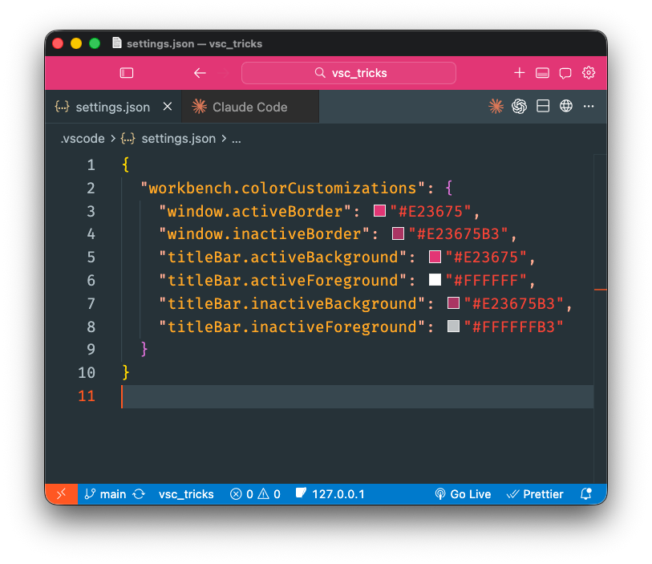

# vsc-tricks

A [Claude Code skill](https://docs.anthropic.com/en/docs/claude-code/skills) that colorizes your VS Code window borders and title bars — giving each project a distinct visual identity so you can tell workspaces apart at a glance.

<p align="center">
  
</p>

## Install

```bash
npx skills add bladnman/vsc_tricks
```

## Usage

```
/vsc-tricks colorize          # random color
/vsc-tricks colorize blue     # color by name
/vsc-tricks colorize #3B82F6  # exact hex
```

The skill writes `workbench.colorCustomizations` into your project's `.vscode/settings.json`, setting the active/inactive border and title bar colors. Existing settings are preserved — only the color block is added or updated.

Run it again any time to pick a new color.
